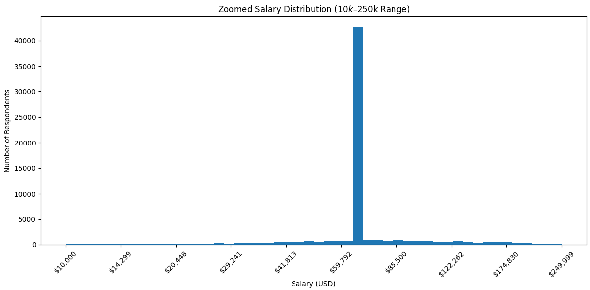

# Workforce & Compensation Data Wrangling Project  
### Preparing a Real-World Dataset for BI, Workforce Insights, and Compensation Analysis  

## 📌 Project Overview  
This project transforms a raw global developer survey into a **clean, analysis-ready dataset** suitable for Business Intelligence (BI), compensation benchmarking, workforce segmentation, and exploratory analytics.  

The original dataset contained inconsistent categories, heavy missingness, and extreme outliers — all issues that would distort dashboards and lead to misleading business decisions.  
This project demonstrates how a data analyst systematically resolves those issues so downstream insights are **accurate, trustworthy, and decision-ready**.

---

## 🎯 Business Value  
This project mirrors what real analytics teams do before compensation or workforce insights reach leadership.  
By cleaning and restructuring the data, we support:

- **Compensation benchmarking** (without outliers inflating pay expectations)  
- **Workforce segmentation** for experience tiers and hiring strategy  
- **Accurate BI dashboards** for salary distribution, experience mapping, and employment trends  
- **Predictive modeling readiness**, including salary forecasting and retention modeling  
- **Reliable reporting** across countries, roles, and experience levels  

Bad data = bad decisions.  
This project ensures the data feeding BI and analytics tools is solid.

---

## 📈 Visual Insights

### **Salary Distribution (Zoomed: $10k–$250k Range)**  
Understanding compensation requires looking past extreme outliers.  
The chart below focuses on the core salary band where **most respondents actually fall**, giving a realistic view of the developer job market.

  

**Key Takeaways:**
- Majority of salaries cluster between **$40k–$120k**  
- Strong peak around **$55k–$75k**, suggesting a global mid-market compensation band  
- Extreme outliers exist but do not represent typical market conditions  
- This zoomed view supports more reliable compensation benchmarking  

## 🛠️ What Was Done (High-Level)
- **Data Quality Audit** to identify unreliable columns and missingness patterns  
- **Standardized inconsistent categorical values** (e.g., Country variants)  
- **Handled missing values** with appropriate imputation strategies  
  - Median for skewed salary fields  
  - Mode for key categorical fields  
- **One-Hot Encoded critical segments** like `Employment`  
- **Applied log transformation** to salary data to stabilize extreme right-skew  
- **Zoomed salary distribution analysis** to reveal true mid-market compensation bands  
- **Engineered an `ExperienceLevel` feature** using industry-aligned tiers  
- **Generated BI-ready summary statistics** for salary, experience, satisfaction, and more  

---

## 🔍 Key Insights
- Salary is **highly right-skewed**, with a small number of extreme outliers distorting the mean.  
- The true compensation clustering sits roughly between **$40k and $120k**, with a peak around **$55k–$75k**.  
- The dataset is dominated by **Intermediate and Senior developers**, which influences interpretation.  
- Several AI-opinion fields have **50k+ missing values**, making them unusable without special treatment.  
- Job satisfaction fields show **zero-inflation**, reflecting survey non-response, not real dissatisfaction.  

---

## 📊 Skills Demonstrated
- Data wrangling & feature engineering  
- Imputation strategy selection  
- Categorical standardization  
- Outlier handling  
- Log transformation & scaling  
- Exploratory data analysis  
- Business impact-focused communication  
- Preparing datasets for BI and modeling  

---

## 📁 Project Structure
workforce_compensation_wrangling/
│── README.md
│── requirements.txt
│── workforce_compensation_data_wrangling.ipynb
│── images/ (optional visual exports)
│── data/ (optional — if allowed; otherwise referenced only)

---

## 🔒 Attribution  
*This project was inspired by the structure of an IBM Data Analyst course lab.  
All analysis, engineering decisions, enhancements, and business framing are my own.  
Dataset rights belong to their respective owners.*

---

## 🚀 Next Steps  
- Build BI dashboards (Power BI or Tableau)  
- Analyze salary × experience interactions  
- Create predictive models for salary trends  
- Extend experience segmentation per country or employment type  
